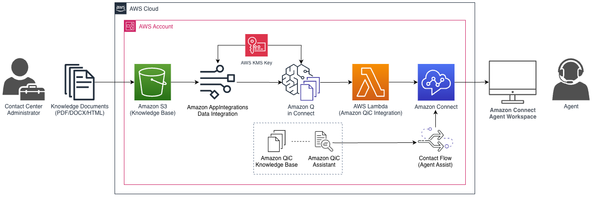

## Amazon Q in Connect - S3 Integration Template

> Amazon Q in Connect features a native Integration with Amazon S3. Please refer to the Amazon Connect Admin Guide: https://docs.aws.amazon.com/connect/latest/adminguide/enable-q.html to enable Amazon Q in Connect and Integrate with Amazon S3.

> This repository is sample code to migrate customers away from using the deprecated [amazon-connect-wisdom-s3-sync](https://github.com/aws-samples/amazon-connect-wisdom-s3-sync) deployments.

---

**Table of Contents**
- [Amazon Q in Connect - S3 Integration Template](#amazon-q-in-connect---s3-integration-template)
- [Description](#description)
- [Tenets](#tenets)
- [Key Features](#key-features)
- [Project Status](#project-status)
- [Architecture](#architecture)
- [Authors](#authors)
- [Contributing](#contributing)
- [Security](#security)
- [License](#license)
- [Amazon Q in Connect Resources](#amazon-q-in-connect-resources)
- [Additional Resources](#additional-resources)
- [Getting Started](#getting-started)
  - [Prerequisites](#prerequisites)
  - [Key Considerations](#key-considerations)
  - [Existing Resources Policy](#existing-resources-policy)
  - [AWS Resources Created by this Deployment](#aws-resources-created-by-this-deployment)
  - [AWS CloudFormation Deployment](#aws-cloudformation-deployment)
  - [Uploading Knowledge Content to Amazon S3](#uploading-knowledge-content-to-amazon-s3)
  - [Testing Amazon Q in Connect](#testing-amazon-q-in-connect)
  - [Conclusion](#conclusion)

## Description
[Amazon Q in Connect](https://aws.amazon.com/connect/q/), an evolution of Amazon Connect Wisdom, uses generative AI to deliver agents suggested responses and actions to address customer questions, providing faster issue resolution and improved customer satisfaction. Knowledge articles, wikis, and FAQs can be spread across separate repositories. Agents waste time trying to navigate these different sources of information while the customer waits for an answer. Amazon Q in Connect uses the real-time conversation with the customer, along with relevant company content, to automatically recommend what to say or what actions an agent should take to better assist customers. With Amazon Q, agents can also use natural language to search across connected knowledge sources to receive generated responses, recommended actions, and links to more information.

**[Amazon Q in Connect - S3 Integration Template](https://github.com/aws-samples/amazon-q-in-connect-s3-integration-template)** enables customers to quickly deploy all of necessary resources to create an Amazon Q in Connect Knowledge Base using Amazon S3 as its data source. Contact center administrators can easily create, update, and remove knowledge content (TXT/HTML/PDF/DOCX) using familiar Amazon S3 object actions.

## Tenets
The following tenets guide the development of **Amazon Q in Connect - S3 Integration Template**:
- **Accelerate Customer Adoption:** Reduce the friction in adopting Amazon Q in Connect; automating the deployment and configuration of the capability, all deployed with a single AWS CloudFormation template.
- **Composable and Reusable:** Ensure the deployment artifacts are composed of unit-tested "building blocks" that can be easily understood and reused by customers.
- **Best Practices:** Leverage software and security best practices throughout the solution, limit external dependencies, handle failures, and ensure least privilege permissions.

## Key Features
This project features a single CloudFormation template that will deploy Amazon Connect Q in Connect configured with an Amazon S3-backed knowledge base.

This deployment will deploy and configure the following resources:
  1) An Amazon S3 Bucket - Store and Manage Knowledge base Content
  2) Amazon Q in Connect - Domain/Assistant, KnowledgeBase, Assistant Association
  3) AWS AppIntegrations:DataIntegration between the KnowledgeBase and Amazon S3.
  4) An AWS KMS Key (CMK) to encrypt Amazon Q in Connect knowledge base content
  5) Amazon Connect Contact Flow pre-configured with [Contact Lens for Amazon Connect](https://aws.amazon.com/connect/contact-lens/) and Amazon Q in Connect

## Project Status
Open Source Release

## Architecture

**Main Template (v2024-03-21)** [Amazon Q in Connect - S3 Integration Template](./amazon-q-in-connect-s3-integration-template.yaml)
- Section 1: Amazon Q in Connect Constructs and Integration [1-amazon-qic-integration](./components/1-amazon-qic-integration/)
- Section 2: Amazon Q in Connect (Agent Assist) Contact Flow [2-amazon-q-connect-contact-flow](./components/2-amazon-q-connect-contact-flow/)

## Authors
[Taylan Unal](https://www.linkedin.com/in/tunal/), Specialist Solutions Architect - CXE

## Contributing
Please see [CONTRIBUTING.md](./CONTRIBUTING.md)

## Security
See [CONTRIBUTING](CONTRIBUTING.md#security-issue-notifications) for more information.

## License
This library is licensed under the MIT-0 License. See the LICENSE file.

## Amazon Q in Connect Resources
- **[Agent Empowerment Suite on Amazon Connect - Amazon Q in Connect](https://catalog.workshops.aws/amazon-connect-agent-empowerment/en-US/amazon-q-in-connect/)**
  - [Enabling Amazon Q in Connect](https://catalog.workshops.aws/amazon-connect-agent-empowerment/en-US/amazon-q-in-connect/set-up-amazon-q-in-connect)
  - [Testing Amazon Q in Connect](https://catalog.workshops.aws/amazon-connect-agent-empowerment/en-US/amazon-q-in-connect/test-amazon-q-in-connect)
- [Amazon Q in Connect - Admin Guide](https://docs.aws.amazon.com/connect/latest/adminguide/amazon-q-connect.html)
- [Amazon Q in Connect - API Reference](https://docs.aws.amazon.com/amazon-q-connect/latest/APIReference/API_Operations.html)
- [Amazon Q Connect JS - SDK](https://github.com/aws/amazon-q-connectjs)
- [Amazon Q in Connect - Service Quotas](https://docs.aws.amazon.com/connect/latest/adminguide/amazon-connect-service-limits.html#q-in-connect-quotas)
- [Amazon Q in Connect - AWS Region Availability](https://docs.aws.amazon.com/connect/latest/adminguide/regions.html#q-connect_region)

## Additional Resources
- [DEPRECATED - Amazon Connect Wisdom S3 Sync](https://github.com/aws-samples/amazon-connect-wisdom-s3-sync)
- [Github - Amazon Connect Wisdom API Snippet (NodeJS)](https://github.com/amazon-connect/amazon-connect-snippets/tree/master/projects/WisdomAPI) - Resources to complete the Amazon Connect Wisdom API blog
- [AWS Blog - Ingesting content to power real-time recommendations and search with Amazon Connect Wisdom](https://aws.amazon.com/blogs/contact-center/ingesting-content-to-power-real-time-recommendations-and-search-with-amazon-connect-wisdom/) - Use the AWS CLI to create Amazon Connect Wisdom Constructs, Integrations, Query an Amazon S3 Knowledge Base

---

## Getting Started
The following instructions will detail deploying the `amazon-q-in-connect-s3-integration-template.yaml` template onto your AWS Account.

**NOTE:** For more detailed, step-by-step guidance, please visit: [Enabling Amazon Q in Connect](https://catalog.workshops.aws/amazon-connect-agent-empowerment/en-US/amazon-q-in-connect/set-up-amazon-q-in-connect)

### Prerequisites
- An AWS Account
- An AWS User with [AdministratorAccess](https://docs.aws.amazon.com/aws-managed-policy/latest/reference/AdministratorAccess.html) IAM Policy attached.
- An existing Amazon Connect Instance deployed in an AWS Region where Amazon Q in Connect is [available](https://docs.aws.amazon.com/connect/latest/adminguide/regions.html#q-connect_region). 
- Familiarity with the AWS Management Console, AWS CloudFormation, and Amazon Connect

### Key Considerations
### Existing Resources Policy
This Deployment **WILL NOT:**
1. Delete any existing Amazon Connect Wisdom/Amazon Q in Connect Resources (Assistants, Knowledge Bases, Assistant Associations) that were not created by this template.
2. Delete the Amazon S3 Bucket created by this deployment, or any of the files uploaded to it.

### AWS Resources Created by this Deployment
- [Amazon Q in Connect](https://aws.amazon.com/connect/q/) - Amazon Q in Connect Assistant, Amazon Q in Connect Knowledge Base, Assistant Association (Assistant-Knowledge Base)
  - Verify that you are not exceeding any of your [Amazon Q in Connect Service Quotas](https://docs.aws.amazon.com/connect/latest/adminguide/amazon-connect-service-limits.html#q-in-connect-quotas)
- [Amazon S3 Bucket](https://aws.amazon.com/s3/), used to store and manage knowledge base content used by Amazon Q in Connect.
- [Amazon AppIntegrations - DataIntegration](https://docs.aws.amazon.com/appintegrations/latest/APIReference/Welcome.html), handles the synchronization of objects stored in the Amazon S3 bucket with Amazon Q in Connect.
- [AWS Lambda](https://aws.amazon.com/lambda/)** - An AWS Lambda function that will integrate Amazon Q in Connect Constructs (WISDOM_ASSISTANT and WISDOM_KNOWLEDGE_BASE) with the provided Amazon Connect instance using the Connect [CreateIntegrationAssociation](https://docs.aws.amazon.com/connect/latest/APIReference/API_CreateIntegrationAssociation.html) API.
- [Amazon Connect Contact Flow](https://docs.aws.amazon.com/connect/latest/adminguide/connect-contact-flows.html) - An Amazon Connect Contact Flow preconfigured with Contact Lens for Amazon Connect and Amazon Q in Connect to start testing Amazon Connect's Real-time Agent Assist capabilities. 

### AWS CloudFormation Deployment
In this section, we will deploy an AWS CloudFormation template that will create Amazon Connect Wisdom constructs, integrate those Wisdom resources with an Amazon Connect Instance, and deploy the required artifacts to use Amazon S3 as a knowledge base for Amazon Connect Wisdom.

**Step 1: Download the `Amazon Q in Connect S3 Sync` CloudFormation Template**
Navigate to the repository root directory, and open the `amazon-q-in-connect-s3-integration-template.yaml` file and [download](https://docs.github.com/en/repositories/working-with-files/using-files/viewing-a-file#viewing-or-copying-the-raw-file-content) the file to your local machine.

**Step 2: Navigate to AWS CloudFormation**
Navigate to AWS CloudFormation on your AWS Management Console (Ex. https://us-east-1.console.aws.amazon.com/cloudformation/)

**Step 3: Create a CloudFormation Stack** 
1. On the AWS CloudFormation Landing page, select `Create Stack`
2. **Prerequisite - Prepare template** - In this section, choose `Template is ready` 
3. **Specify template** - choose `Upload a template file` and select the `Choose file` button to upload a CloudFormation template from your local machine.
   1. Upload the template for this deployment that you've downloaded, or download the CloudFormation template now [here](./amazon-q-in-connect-s3-sync.yaml)
4. To accept your settings, choose `Next` to proceed to the `Specify stack details` page.
  
**Step 4: Specify Stack Details**
In this section, we'll specify the After selecting a stack template, specify the stack name and values for the parameters that were defined in the deployment template.

1. `Stack Name`: Choose a stack name like: `amazon-qic-s3-integration` or `amazon-q-in-connect-workshop`
   1. The stack name is an identifier that helps you find a particular stack from a list of stacks. A stack name can contain only alphanumeric characters (case-sensitive) and hyphens. It must start with an alphabetic character and can't be longer than 128 characters.
2. `AmazonConnectInstanceARN`: Enter your **Amazon Connect Instance ARN** - [Find your Amazon Connect instance ID/ARN](https://docs.aws.amazon.com/connect/latest/adminguide/find-instance-arn.html)
   1. For the best results, specify an Amazon Connect Instance without an existing Wisdom Deployment
3. `S3BucketName`: Provide a globally unique name for a new Amazon S3 Bucket, which will be used to store knowledge content for Amazon Q in Connect.
   1. Do **not** enter an existing S3 bucket. This process will create a new one in the account, and will require you to retry the process if a S3 bucket with this name already exists. 
   2. We recommend making this value unique, such as `s3-amazon-q-in-connect-bucket` as long as the name is less than 63 characters and all lowercase. You can find all the S3 bucket naming rules [here.](https://docs.aws.amazon.com/AmazonS3/latest/userguide/bucketnamingrules.html)

After configuring your Stack name and parameters, click the `Next` button to continue. 

**Step 5: Configure stack options**
Leave all options on the `Step 3 - Configure stack options` page as defaults, scroll to the bottom of the page, and click the `Next` button to continue.

**Step 6: Review**
The review page is the final step before your stack is deployed, please review the parameter values you entered in the previous steps.
1. If you need to change any of the values before launching the stack, choose Edit on the appropriate section to go back to the page that has the setting that you want to change.
2. After you review the stack creation settings, choose `Create stack` to launch your stack.
> **NOTE:** This AWS CloudFormation deployment should take less than 5 minutes to complete.
3. Once the stack was successfully deployed, you will see the stack status change to **CREATE_COMPLETE**.

---

### Uploading Knowledge Content to Amazon S3
After the stack has deployed successfully, we will upload the sample `password-reset.html` file into the Amazon S3 Bucket that was created as a part of this deployment.

After the AWS CloudFormation Stack from the previous section has successfully deployed, you can manage knowledge content by (Creating, Updating, Deleting) Knowledge content files (HTML/PDF/DOCX) files on the S3 Bucket created by the deployment.

1.  Sign in to the AWS Management Console and open the Amazon S3 console at https://console.aws.amazon.com/s3/
  
2.  From the list of Amazon S3 Buckets, you should see new Amazon S3 bucket created by the CloudFormation template. Select the bucket name to open it.

3. Download the following sample file:[password-reset.html](./sample/password-reset.html) to upload into your Amazon S3 bucket. . This HTML file is from the Amazon Connect Admin Guide (https://docs.aws.amazon.com/connect/latest/adminguide/password-reset.html), and provides guidance on how to reset an Amazon Connect user's password.

4. Drag and drop the `password-reset.html` file into your Amazon S3 bucket. Select **Upload** at the bottom of the screen. 

5. You will see a green banner showing **Upload succeeded**. Select close.

---

### Testing Amazon Q in Connect
Reference: https://catalog.workshops.aws/amazon-connect-agent-empowerment/en-US/amazon-q-in-connect/test-amazon-q-in-connect#testing-amazon-q-in-connect-on-your-instance

> **NOTE:** Make sure that your Amazon Connect User has the appropriate Security Profile permission: `Agent Applications -> Amazon Q in Connect -> View` to access to Amazon Q in Connect on the Agent Workspace. [Admin Guide - Update security profiles](https://docs.aws.amazon.com/connect/latest/adminguide/update-security-profiles.html)

Now that you have deployed Amazon Q in Connect and uploaded your first knowledgebase file, it's time to test Amazon Q in Connect and it's real-time agent assist capabilities.
> **NOTE** The following steps will detail testing Amazon Q in Connect with a Chat Contact, but note that all of the same functionality is available for **Voice** contacts.

**Review Contact Flow**
1. Navigate to Amazon Connect Console
2. Using the navigation bar on the left side of your screen, Navigate to Flows, review the Contact Flow called `RealtimeAgentAssistFlow-abc123`
3. Note that the QueueARN for `BasicQueue` and your Amazon Q in Connect `AssistantARN` have been pre-defined within the Contact Flow.

**Test Chat:**
1. Navigate to "Test Chat" "https://[INSTANCENAME].my.connect.aws/test-chat"
2. Click on Test Settings
3. Select the Contact Flow named `RealtimeAgentAssistFlow-abc123`
4. An Amazon Connect Chat widget will **appear** and initiate a contact that will be routed to the default "BasicQueue" defined on your Amazon Connect Instance.

**Agent Workspace:**
1. Navigate to the Amazon Connect Agent Application to Access Amazon Q in Connect. You can launch the agent application from the top right-hand corner of the Amazon Connect console by selecting "Agent application" or by using the URL below.
   > `https://instancename.my.connect.aws/agent-app-v2/`
2. Once you have reached the Amazon Connect Agent Workspace, to recieve the Chat contact initiated in the previous step, [Set your status to **Available**](https://docs.aws.amazon.com/connect/latest/adminguide/set-status-available.html) in the top left corner of the Agent Workspace.
3. Accept the incoming Chat contact.

**Testing Realtime Agent Assist:**
> Reference: [Use real-time recommendations from Amazon Q in Connect](https://docs.aws.amazon.com/connect/latest/adminguide/use-realtime-recommendations.html)
1. Navigate back to the Chat Widget that you had opened earlier.
2. As the "Customer", ask questions related to the `password-reset` document, like `Can you help me reset my password?` or `I need to reset my password`
3. Within seconds, Amazon Q in Connect will display: the detected issue,the Generative AI-powered response, generated solution, and References to relevant knowledge content. 
4. Click on `password-reset` to open the document within the Agent Workspace as a new tab. 

**Testing Manual Agent Assist:**
> Reference: [Search for content using Amazon Connect Wisdom](https://docs.aws.amazon.com/connect/latest/adminguide/search-for-answers.html)
1. Within the Amazon Connect Agent Workspace, click on the the "Amazon Q in Connect" search bar on the top right corner of the page.
2. Search for terms related to the knowledge article you uploaded, like "password reset".
3. Within seconds, Amazon Q in Connect will display a Generative AI-powered Solution and References to relevant knowledge content based on the query.
4. Within the References section, you should see the `password-reset` document that you uploaded earlier in this guide.
5. Click on `password-reset` to open the document within the Agent Workspace as a new tab. 

Congratulations! You have successfully deployed and tested Amazon Q in Connect's Realtime Agent Assist capabilities.

### Conclusion
You have successfully deployed Amazon Q in Connect on your Amazon Connect instance, uploaded knowledge content to your Amazon S3 KnowledgeBase, and tested Amazon Q in Connect's Real-time Agent Assist capabilities!
